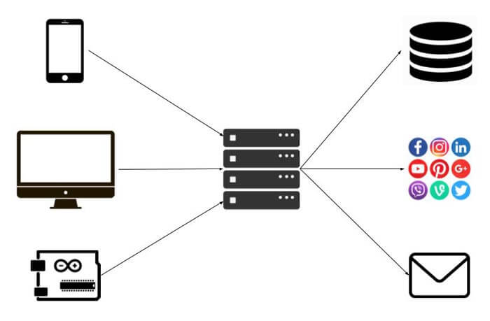

# Aplicación Web IFTT #

## Antes de empezar ##

* [IFTT con Arduino y NODEMCU](https://programarfacil.com/blog/arduino-blog/como-ifttt-arduino-nodemcu/) (Web programarfacil.com)

### ¿Qué son los servicios web?  ###

Seguramente ya me hayas oído hablar en más de una ocasión de los servicios web o API web. Es una interfaz de software que nos permite comunicarnos entre diferentes sistemas es decir, lo que pretenden es que podamos acceder a las bases de datos, a los servicios, herramientas, etc…. de una máquina a través de URLs.

Vamos a verlo con un ejemplo. Si quieres almacenar una temperatura en una base de datos, creas una página web con PHP, C#, Java o el lenguaje de backend que prefieras. Esta página web lo que hará es capturar la información que se envíe mediante los diferentes métodos HTTP (GET, POST, PUSH, DELETE, HEAD) y almacenarla en la base de datos.

Es un proceso sencillo, tu desde un navegador, desde otra aplicación, desde un móvil o desde un Arduino haces la llamada a una URL como www.midominio.com/guardar_temperatura.php?temperatura=145 y la página PHP se encarga de recoger ese valor y almacenarlo.

Pues así funciona el servicio Maker de IFTTT. A través de URLs lanzaremos los eventos que ejecutarán las acciones como guardar temperatura, enviar un tweet, enviar un email, encender una luz o lo que sea.

*Texto e imágenes extraido de la web programarfacil.com https://programarfacil.com/blog/arduino-blog/como-ifttt-arduino-nodemcu/*
