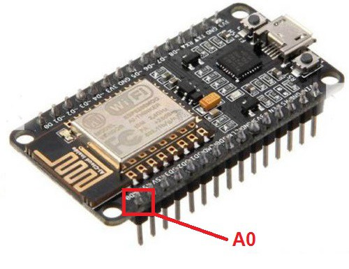

# LM35 y Blynk app #

## Antes de empezar ##

* [Medir información con Arduino y Sensor LM35](https://www.luisllamas.es/medir-temperatura-con-arduino-y-sensor-lm35/) (Web Luis Llamas)

````csharp
const int sensorPin= A0;

void setup()
{
  Serial.begin(9600);
}

void loop()
{
  int value = analogRead(sensorPin);    //Leemos el valor del sensor
  float millivolts = (value / 1023.0) * 5000;   // Realizamos la operación para saber los milivoltios consumidos
  float celsius = millivolts / 10; // Convertimos a celsius
  Serial.print(celsius);
  Serial.println(" C");
  delay(1000);
}
````

## Conectando LM35 con Blynk ##

Para crear nuestro proyecto en Blynk usaremos la misma estructura que cuando obteniamos los datos del sensor DHT11, añadiremos un widgets de Value Display con el pin Virtual 0 (V0) para leer los datos que lleguen de nuestra placa.

El sensor lo hemos colocado en el pinA0



```csharp
/*************************************************************
  Ejemplo básico del DHT11 que hicimos modificado para este sensor
 *************************************************************/

/* Comment this out to disable prints and save space */
#define BLYNK_PRINT Serial
#include <ESP8266WiFi.h>
#include <BlynkSimpleEsp8266.h>

const int sensorPin = A0;

char auth[] = "YourAuthToken";

// Your WiFi credentials.
// Set password to "" for open networks.
char ssid[] = "YourNetworkName";
char pass[] = "YourPassword";

BlynkTimer timer;

// This function sends Arduino's up time every second to Virtual Pin (5).
// In the app, Widget's reading frequency should be set to PUSH. This means
// that you define how often to send data to Blynk App.
void sendSensor()
{
  int value = analogRead(sensorPin);
  float millivolts = (value / 1023.0) * 5000;
  float t = millivolts / 10;
  Blynk.virtualWrite(V0, t);

}

void setup()
{
  // Debug console
  Serial.begin(9600);

  Blynk.begin(auth, ssid, pass);
  // You can also specify server:
  //Blynk.begin(auth, ssid, pass, "blynk-cloud.com", 80);
  //Blynk.begin(auth, ssid, pass, IPAddress(192,168,1,100), 8080);

  dht.begin();

  // Setup a function to be called every second
  timer.setInterval(1000L, sendSensor);
}

void loop()
{
  Blynk.run();
  timer.run();
}


```
