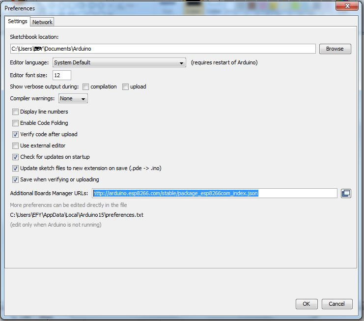
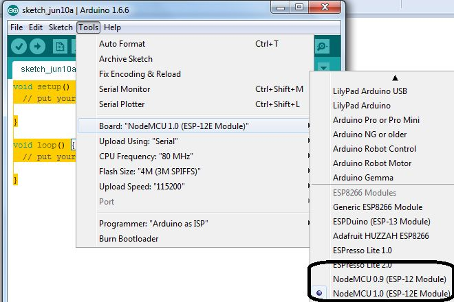
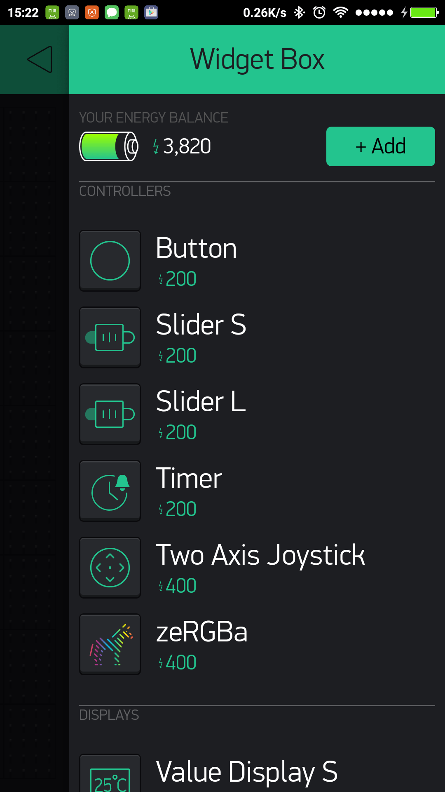
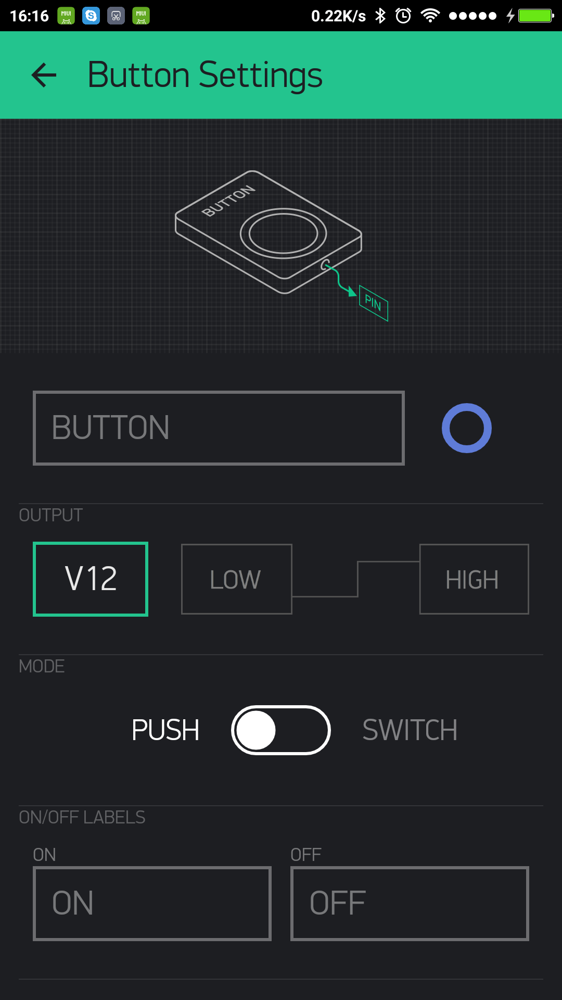
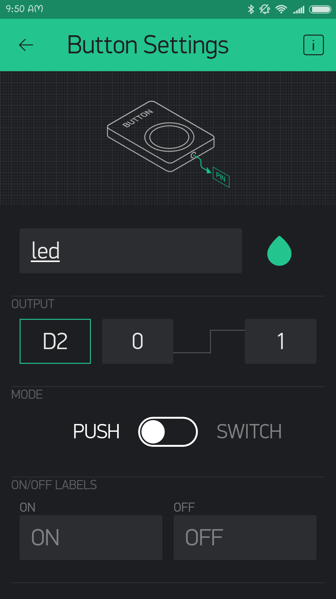

# Primeros pasos con NodeMCU (1-10-2018) #

## Introducción ##

NodeMCU es una placa de desarrollo totalmente abierta, tanto a nivel de software como de hardware igual que ocurre con Arduino. Una de las diferencias de esta placa es que incluyen el famoso ESP8266 por lo que podremos dotar a nuestros proyectos de conectividad WIFI con la que poder controlar nuestros sensores, almacenar los datos obtenidos por estos en la nube o un sinfín de combinaciones con la que poder trabajar el IOT (Internet of Things) en nuestros proyectos

## Pinout ##

## Instalación NodeMCU IDE Arduino ##

En el IDE de Arduino ve a **Archivo->Preferencias**

Ahora copia el link de abajo y colocalo en el cuadro de "Gestor de URLs Adicionales de Tarjetas"

**http://arduino.esp8266.com/stable/package_esp8266com_index.json**

Reinicia el IDE de Arduino después

Ve a **Herramientas->Placas** y selecciona NodeMCU 1.0. Ya estamos listos para empezar!!

## Nuestro primer proyecto con NodeMCU + Blynk ##

Blynk es una aplicación para android/ios que nos permite controlar nuestro ESP8266 de una manera bastante rápida y sencilla. Tienes más información en su [WEB](https://www.blynk.cc/)

En este primer proyecto nosotros usaremos la app de Blynk para configurar un botón que encenderá un led de forma remota conectandose con nuestra placa NodeMCU. Pero antes de empezar tenemos que instalar y configurar Blynk. [Enlace a su web de los pasos necesarios](https://www.blynk.cc/getting-started/) que te resumo aquí:
* Instalar la app Blynk en tu móvil android o ios
* Crear una cuenta en la aplicación
* Crear un nuevo proyecto, incluyendo la placa y las coneción que usará (Wifi, Bluetooth...)
* Una vez el proyecto está creado recibiremos un AUTH TOKEN en nuestro correo, que copiaremos para incluir en el código de Arduino.
* [Instala la librería Blynk para el IDE de Arduino](https://github.com/blynkkk/blynk-library/releases/tag/v0.5.4)
* Ve a **Archivo->Ejemplos->Blynk->Boards_Wifi->NodeMCU**
* En **aauth** coloca el AUTH Token que recibiste por correo cuando creaste el proyecto.
* En **ssid** coloca el nombre de la red wifi a la que se conectará.
* En **pass** la contraseña de la red Wifi.
* Carga el proyecto.

Muy bien, ya tenemos el IDE de Arduino configurado y subido a la placa y instalada la aplicación y creado el proyecto, pero está completamente en blanco, vamos a añadirle widgets!!

### Añadiendo elementos a nuestra app ###

Para añadir un elemento arrástralo desde el menú de la derecha, vamos a empezar con un botón.

Cada elemento o widgets que arrastremos tiene su propia configuración

El parámetro más importante es el pin al que hemos conectado algo, en este caso conectaremos un led al D2

De está forma cuando nosotros pulsemos el botón la aplicacion mandará un "digitalWrite(componente, HIGH)" y el led que tenemos conectado en nuestro D2 se encenderá. Si queremos que se quede siempre encendido como un interruptor en la configuración del botón marcamos "Switch"

### Mejoras a realizar ###
* Conecta 2 o 3 leds simulando distintas luces de tu casa que podrás encender y apagar desde tu aplicación.
* Explora como podemos recibir datos para visualizarlos por pantalla.

## Enlaces interesantes ##

* [NodeMCU - Programarfácil](tps://programarfacil.com/podcast/nodemcu-tutorial-paso-a-paso/)
