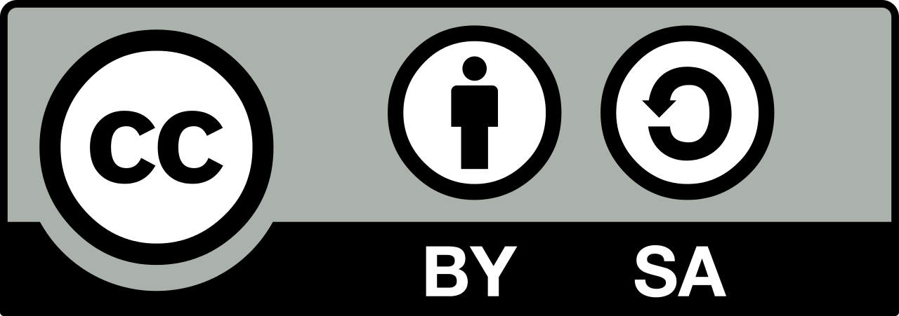

# Curso de Arduino 2018-2019 #

## Indice ##
* [Primeros pasos con NodeMCU](https://github.com/laescuelamaker/Curso-Arduino/tree/master/Clases/Primeros-pasos-NodeMCU)
* [Usando Blynk](Clases/Usando-Blynk)
* [Interrupciones Arduino](Clases/Interrupciones-Arduino)
* [RGB](Clases/RGB)
* [LM35 y BLynk](Clases/LM35-y-Blynk)
* [IFTT](Clases/IFTT)
* [ThingSpeak](Clases/ThingSpeak)

## Autor ##

Realizado por Ángel López Barrilero para La Escuela Maker.

Twitter: [@anlobarri](https://www.twitter.com/anlobarri)

Correo: angel@laescuelamaker.com

## Licencia ##
Licensed under a [Creative Commons Attribution-ShareAlike 4.0 International License](https://creativecommons.org/licenses/by-sa/4.0/)

